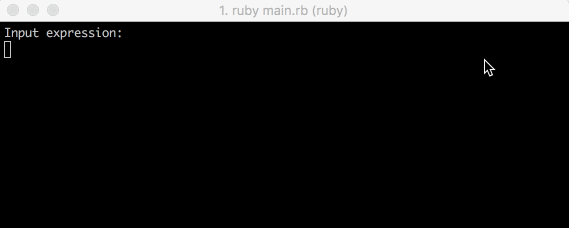

# RPN_calculator

Calculator that can count in reverse polish notation. An example of the calculator:

```
# We run our program
./calculator
2
3
+
# => 5

7
12
14
+
*
# => 182
```
Implemented 5 operations: `+`, `-`, `/`, `*`, `!`

The essence of the last operation is that it should reset the specified number of single-bit number starting with the youngest. This operation takes a 2 argument. The first argument - that number, over which the surgery is performed. The second - the number of bits that need to be reset. For example, take the number 93 (01011101) as an argument and 3 as the second argument. This means starting with the least significant bit we need to reset the 3 units. That is 01011101 or 01010000 become 80.

```
93
3
!
# => 80
```


